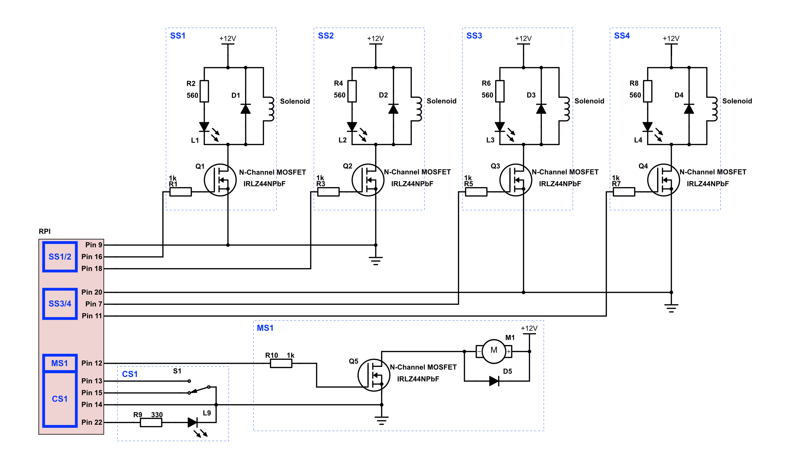

### Wire configuration for final gizmo

<table>
  <tr>
    <th>System</th>
    <th>Element</th>
    <th>GPIO Pin</th>
    <th>BCM Pin</th>
    <th>Colour</th>
    <th>Purpose</th>
    <th>Connected to...</th>
  </tr>
  <tr>
    <td>Common</td>
    <td>GRND</td>
    <td>9,14,20</td>
    <td>-</td>
    <td></td>
    <td>Common ground</td>
    <td>Proto board input 4</td>
  </tr>
  <tr>
    <td rowspan="5">SS1-4</td>
    <td>S1</td>
    <td>16</td>
    <td>23</td>
    <td></td>
    <td>I/O Output</td>
    <td>Proto board input 3</td>
  </tr>
  <tr>
    <td>S2</td>
    <td>18</td>
    <td>24</td>
    <td></td>
    <td>I/O Output</td>
    <td>Proto board input 1</td>
  </tr>
  <tr>
  </tr>
  <tr>
    <td>S3</td>
    <td>11</td>
    <td>17</td>
    <td></td>
    <td>I/O Output</td>
    <td>Proto board input 7</td>
  </tr>
  <tr>
    <td>S4</td>
    <td>13</td>
    <td>27</td>
    <td></td>
    <td>I/O Output</td>
    <td>Proto board input 8</td>
  </tr>
  <tr>
    <td>MS1</td>
    <td>MOT1</td>
    <td>12</td>
    <td>18</td>
    <td></td>
    <td>PWM Output</td>
    <td>Proto board input 2</td>
  </tr>
  <tr>
    <td rowspan="2">CS1</td>
    <td>MS1</td>
    <td>15</td>
    <td>22</td>
    <td></td>
    <td>I/O Input</td>
    <td>Proto board input 5</td>
  </tr>
  <tr>
    <td>LED</td>
    <td>7</td>
    <td>4</td>
    <td></td>
    <td>I/O Output</td>
    <td>Proto board input 3</td>
  </tr>
</table>

### Circuit Diagram

Displaying latest version of circuit diagram.

