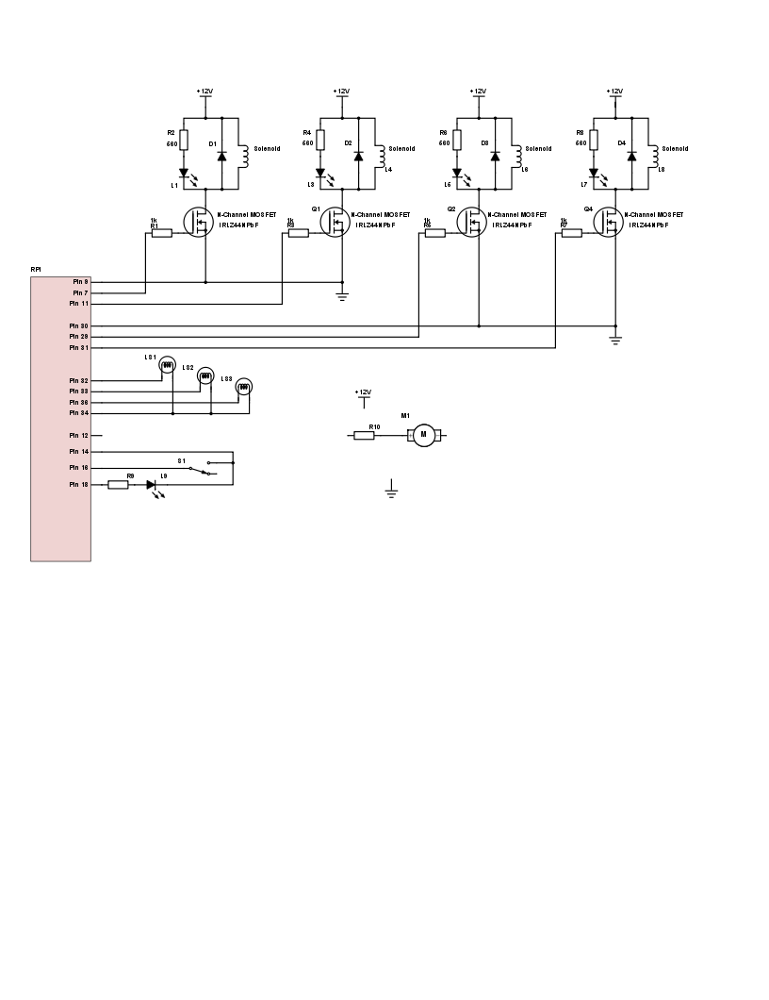

### Wire configuration for final gizmo

<table>
  <tr>
    <th>System</th>
    <th>Element</th>
    <th>GPIO Pin</th>
    <th>BCM Pin</th>
    <th>Colour</th>
    <th>Purpose</th>
    <th>Connected to...</th>
  </tr>
  <tr>
    <td rowspan="3">SS1-2</td>
    <td>GRND</td>
    <td>9</td>
    <td>-</td>
    <td></td>
    <td>Common ground</td>
    <td>GRND of SolenoidSystem 1&2</td>
  </tr>
  <tr>
    <td>S1</td>
    <td>7</td>
    <td>4</td>
    <td></td>
    <td>I/O Output</td>
    <td>Gate pin of transistor sol-1</td>
  </tr>
  <tr>
    <td>S2</td>
    <td>11</td>
    <td>17</td>
    <td></td>
    <td>I/O Output</td>
    <td>Gate pin of transistor sol-2</td>
  </tr>
  <tr>
    <td rowspan="3">SS3-4</td>
    <td>GRND</td>
    <td>30</td>
    <td>-</td>
    <td></td>
    <td>Common ground</td>
    <td>GRND of SolenoidSystem 3&4</td>
  </tr>
  <tr>
    <td>S3</td>
    <td>29</td>
    <td>5</td>
    <td></td>
    <td>I/O Output</td>
    <td>Gate pin of transistor sol-3</td>
  </tr>
  <tr>
    <td>S4</td>
    <td>31</td>
    <td>6</td>
    <td></td>
    <td>I/O Output</td>
    <td>Gate pin of transistor sol-4</td>
  </tr>
  <tr>
    <td rowspan="4">MS1</td>
    <td>GRND</td>
    <td>14</td>
    <td>-</td>
    <td></td>
    <td>Common ground</td>
    <td>GRND of MotorSystem</td>
  </tr>
  <tr>
    <td>MOT1</td>
    <td>12</td>
    <td>18</td>
    <td></td>
    <td>PWM Output</td>
    <td><i>to motor driver...</i></td>
  </tr>
  <tr>
    <td>MS1</td>
    <td>16</td>
    <td>23</td>
    <td></td>
    <td>I/O Input</td>
    <td>Microswitch pin 1</td>
  </tr>
  <tr>
    <td>LED</td>
    <td>18</td>
    <td>24</td>
    <td></td>
    <td>I/O Output</td>
    <td>LED pin</td>
  </tr>
  <tr>
    <td rowspan="4">LS1</td>
    <td>GRND</td>
    <td>34</td>
    <td>-</td>
    <td></td>
    <td>Common ground</td>
    <td>GRND of LightSystem</td>
  </tr>
  <tr>
    <td>L1</td>
    <td>32</td>
    <td>12</td>
    <td></td>
    <td>I/O Output</td>
    <td>Light 1</td>
  </tr>
  <tr>
    <td>L2</td>
    <td>33</td>
    <td>13</td>
    <td></td>
    <td>I/O Output</td>
    <td>Light 2</td>
  </tr>
  <tr>
    <td>L3</td>
    <td>36</td>
    <td>16</td>
    <td></td>
    <td>I/O Output</td>
    <td>Light 3</td>
  </tr>
</table>

### Circuit Diagram

Displaying latest version of circuit diagram.

